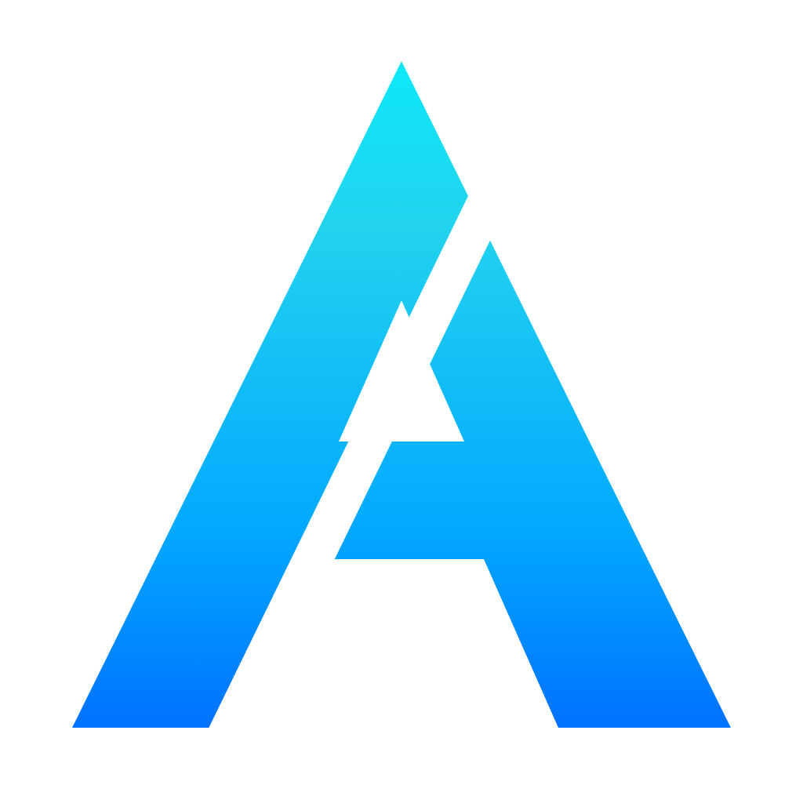
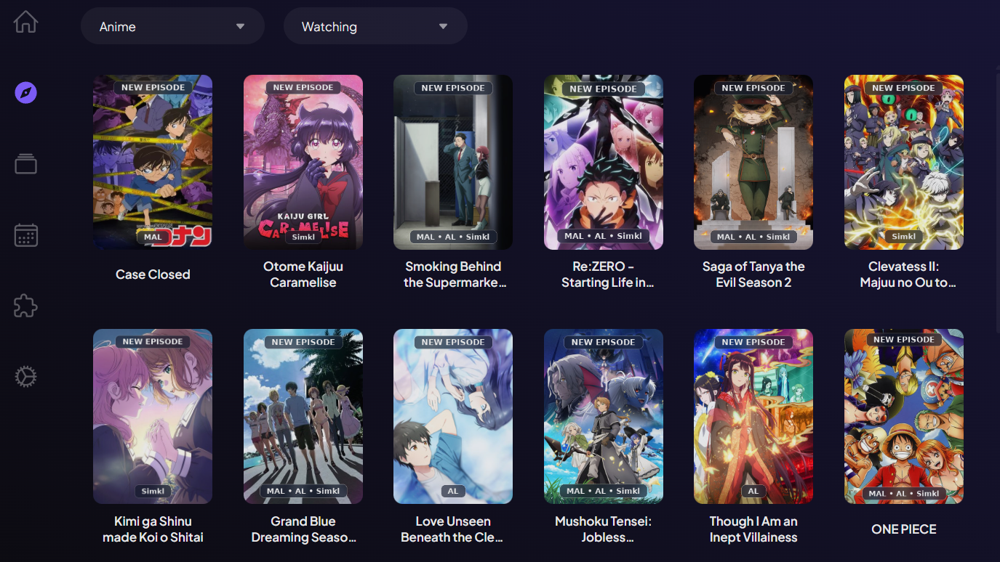
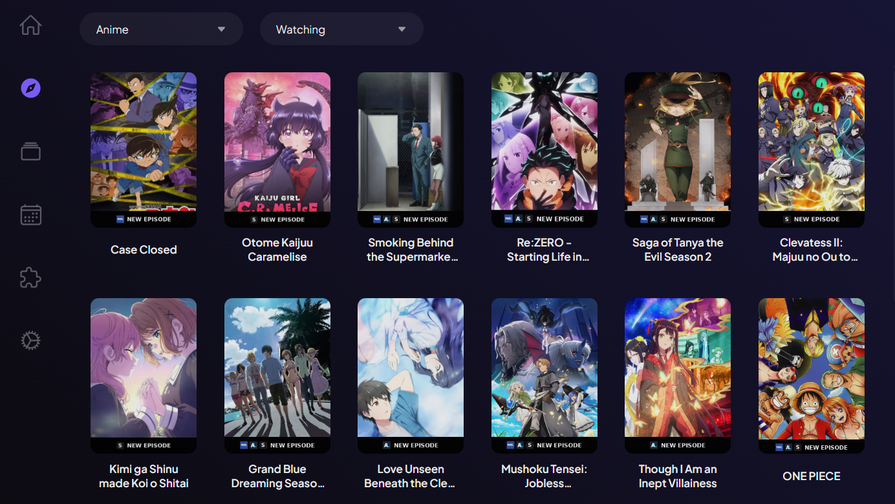
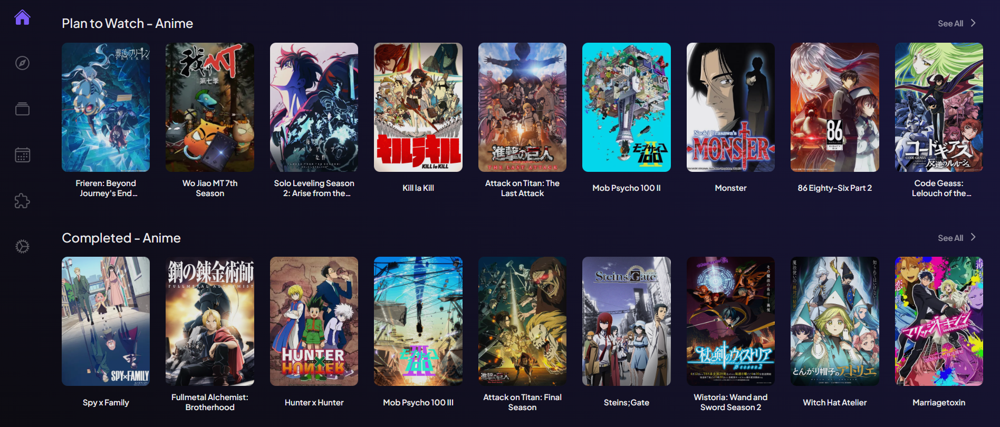
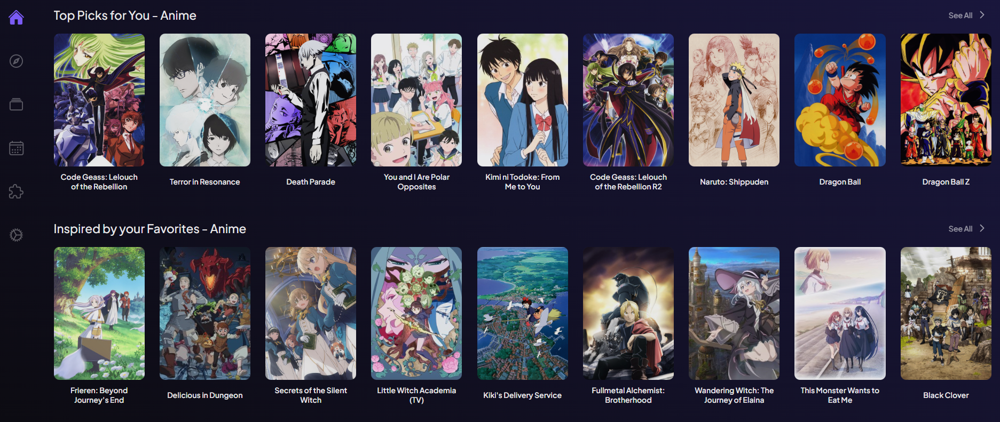
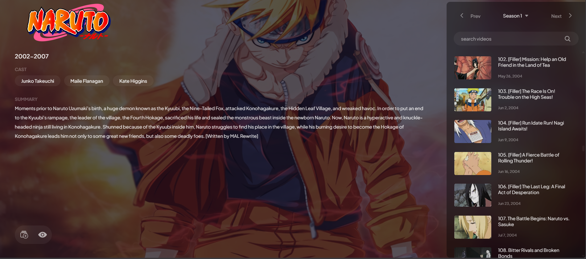
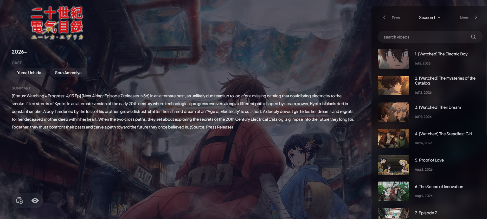

<p align="center">
  
</p>

# AniSync - MyAnimeList, AniList & Simkl Tracker for Stremio & Nuvio

[](LICENSE)
[](https://python.org)
[](https://pgjones.gitlab.io/quart/)
[](https://www.docker.com)
[](https://stremio.com)
[](https://nuvio.tv)
[](https://ko-fi.com/atharvkharbade)

**AniSync** is an anime addon built for Stremio and Nuvio that connects your tracking accounts (**MyAnimeList**, **AniList**, and **Simkl**) in one place. It syncs your watchlists, overlays new episode indicators on posters, shows filler warnings and watched tags, and gives you personalized recommendations and discovery catalogs.

---

## 🌟 Features

### 📺 Multi-Tracker Poster Badges & `NEW EPISODE` Overlays
When a new episode releases for a show you're watching, AniSync adds a `NEW EPISODE` indicator right on the poster. If you use multiple tracking services, it shows their logos side-by-side (MAL, AniList, Simkl) so you know where it's tracked.

You can choose between two clean styles in your settings:
* **Modern Design (NEW!)**: A top banner with floating badge boxes at the bottom.
* **Classic Design**: A solid black bar across the bottom with tracker logos and text.

<p align="center">
  <b>Modern Design (NEW!)</b><br>
  
</p>

<p align="center">
  <b>Classic Design</b><br>
  
</p>

---

### 🗂️ Synchronized Watchlist Catalogs
Connect MyAnimeList, AniList, and Simkl at the same time. AniSync organizes your anime into unified rows on your home screen:
* **Combined Watchlists**: Merges your *Watching*, *Plan to Watch*, *Completed*, *On Hold*, and *Dropped* lists across all connected accounts.
* **Multi-Account Auto-Merge**: Automatically merges progress across trackers so everything stays up to date.



---

### 🤖 Personalized Recommendations (100% Explained)
Discover new anime right on your home screen based on what you enjoy:
* **Clear Reasons**: Every suggested anime explains why it's there (e.g. *"Inspired by your favorites: Hunter x Hunter"* or *"Popular Dark Fantasy based on your taste"*).
* **Gemini AI Insights**: You can optionally add a free Google Gemini API key to get natural language recommendation notes.
* **5 Dedicated Rows**: *Top Picks for You*, *Inspired by your Favorites*, *More from your Watchlist*, *Because you Watched [Anime]*, and *Curated Genre Collections*.



---

### 🚫 Filler Warnings & Inline `[Filler]` Tags
Skip the non-canon episodes easily:
* **Filler Arc Warnings**: Shows a warning in the anime summary when you are in or approaching a filler arc (e.g. `[Current Filler Arc: Episodes 101–106]` or `[Upcoming Filler Arc: Episodes 101–106]`).
* **Episode Tags**: Adds a `[Filler]` tag directly next to episode titles in the player list.



---

### ✅ Episode Watched Indicators (`[Watched]`)
Shows a `[Watched]` tag next to episodes you have already finished based on your tracker progress, making it easy to see where you left off.



---

### 📚 Multi-Provider Metadata Engine
Choose where you want your anime summaries, ratings, and artwork to come from:
* **Kitsu (Default)**: Fast metadata with reliable stream matching.
* **MyAnimeList (MAL)**: Official MAL descriptions and community scores.
* **AniList**: AniList summaries, average ratings, and banner backgrounds.

---

### 🌐 Universal Title Language Localization
Switch anime and episode titles across the whole addon with one click:
* **English** (e.g. *Attack on Titan*, *Case Closed*)
* **Romaji** (e.g. *Shingeki no Kyojin*, *Meitantei Conan*)
* **Japanese / Native** (e.g. *進撃の巨人*, *名探偵コナン*)

---

### 🧭 Rich Discovery Catalogs
Explore curated anime rows updated directly from the community:
* **Spotlight**: Featured highlights and top picks.
* **Airing Schedule**: Anime broadcasting today with release times.
* **This Season**: Top anime currently airing this season.
* **Trending Now**: Shows gaining popularity right now.
* **Top Airing**: Highest-rated anime airing this season.
* **All-Time Highest Rated**: The highest-rated anime of all time.
* **All-Time Most Popular**: The most watched anime across trackers.

---

### ⏳ Real-Time Airing Countdowns
Shows live release countdowns in the synopsis of ongoing anime (e.g. `[Next Airing: Episode 7 releases in 6d]`), so you know when the next episode drops.

---

### 🎨 Custom Poster Art & Rating Overlays
* **High-Res Artwork**: Crisp posters from AniList, MAL, and Kitsu.
* **RPDB Support**: Add your Rating Poster DB API key to overlay rating badges on posters.
* **Custom Poster Endpoints**: Works with external poster proxies (like BetterPosters).

---

### 🎛️ Custom Catalog Sorting & Organization
You have full control over your catalogs in the configuration dashboard:
* Drag and drop to reorder catalogs in any sequence.
* Enable or disable individual watchlists, single-tracker rows, recommendations, or discovery charts to keep your home screen clean.

---

### 🔞 NSFW / Adult Content Filtering
An easy toggle in the dashboard to filter out 18+ and adult content across Discovery, Recommendations, Search, and Watchlists.

---

### 👤 Guest Mode (No Account Required)
You can install and use AniSync even without logging into any tracking account:
* Get full access to Discovery Catalogs, Airing Countdowns, Episode Filler Tags, Custom Poster Art, Title Languages, and NSFW filtering out of the box.

---

## 📥 Installation

1. Visit the **[AniSync Configuration Dashboard](https://anisync.qzz.io)**
2. (Optional) Log in with **MyAnimeList**, **AniList**, or **Simkl** (or continue as Guest).
3. Choose your preferred title language, metadata provider, poster overlay style, and catalogs.
4. Click **Install Addon** or copy the **Manifest URL** into Stremio or Nuvio.

---

## 🛠️ Self-Hosting

### 1. Environment Configuration

Create a `.env` file using `.env.example`:

```env
# ── App ───────────────────────────────────────────────────────────────────
SECRET_KEY=generate_a_secure_random_string_here
FLASK_DEBUG=0
FLASK_RUN_HOST=yourdomain.com

# ── MongoDB ───────────────────────────────────────────────────────────────
MONGO_URI=mongodb://mongo:27017
MONGO_DB=anisync

# ── Tracker OAuth Credentials ─────────────────────────────────────────────
# MyAnimeList (https://myanimelist.net/apiconfig)
MAL_CLIENT_ID=your_mal_client_id
MAL_CLIENT_SECRET=your_mal_client_secret

# AniList (https://anilist.co/settings/developer)
ANILIST_CLIENT_ID=your_anilist_client_id
ANILIST_CLIENT_SECRET=your_anilist_client_secret

# Simkl (https://simkl.com/settings/developer)
SIMKL_CLIENT_ID=your_simkl_client_id
SIMKL_CLIENT_SECRET=your_simkl_client_secret

# ── Proxy Support (Optional) ──────────────────────────────────────────────
# Route external API requests through HTTP, HTTPS, or SOCKS5 proxies
PROXY_URL=
PROXY_MAL=
PROXY_ANILIST=
PROXY_SIMKL=
PROXY_JIKAN=
PROXY_KITSU=
PROXY_ANIZP=
```

### 2. Docker Compose

```yaml
services:
  app:
    image: ghcr.io/atharvkharbade/anisync-addon:latest
    container_name: anisync
    mem_limit: 1g
    memswap_limit: 2g
    env_file:
      - .env
    environment:
      - MONGO_URI=mongodb://mongo:27017
    depends_on:
      mongo:
        condition: service_healthy
    healthcheck:
      test: ["CMD", "python3", "-c", "import urllib.request; urllib.request.urlopen('http://localhost:5000/health')"]
      interval: 30s
      timeout: 10s
      retries: 3
      start_period: 10s
    networks:
      - web-network
      - internal
    restart: unless-stopped

  mongo:
    image: mongo:7
    container_name: anisync-mongo
    mem_limit: 1g
    memswap_limit: 2g
    volumes:
      - mongo_data:/data/db
    healthcheck:
      test: ["CMD", "mongosh", "--eval", "db.adminCommand('ping')"]
      interval: 10s
      timeout: 5s
      retries: 5
    networks:
      - internal
    restart: unless-stopped

volumes:
  mongo_data:

networks:
  web-network:
    external: true
  internal:
    driver: bridge
```

---

## ☕ Support the Project

If you enjoy using AniSync and would like to support its ongoing development and server hosting costs, consider [buying me a coffee on Ko-fi](https://ko-fi.com/atharvkharbade)! Any support is greatly appreciated.

---

## ⚠️ Disclaimer

**AniSync** is an open-source tool for synchronizing progress and displaying metadata from anime tracking services. It does not host, store, stream, or distribute any media or video content. Users are solely responsible for complying with the terms of service of any third-party services used in conjunction with AniSync.

---

## 📄 License

Distributed under the MIT License. See [LICENSE](LICENSE) for more information.
